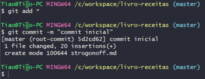

# Primeiros comandos com Git

## Iniciar o Git

```powershell
git init
git add
git commit
```

### Configuração inicial

```powershell
git config --global user.email "tiaogogo@gmail.com"
git config --global user.name tiaonazario
```

## Iniciar o versionamento

Criar um arquivo “strogonoff.md”

```markdown
# Strogonoff de Frango:chicken:

### Ingredientes

- 1kg de peito de frango sem pele
- 1 tablete de caldo de galinha
- 3 colheres de sopa de óleo
- 2 latas de creme de leite sem soro
- 2 colheres de sopa de molho de tomate
- 2 colheres de sopa de ketchup
- Champignon
- Batata palha e arroz branco para acompanhar

### Modo de Preparo

1. Em uma panela a fogo médio, acrescente o óleo e o caldo de galinha e, logo em seguida coloque o frango picado em cubos na panela e deixe cozinhar, sempre dando uma olhadinha para não queimar.
2. Assim que o frango estiver bem cozido, acrescente o molho de tomate, o ketchup, a mostarda e champignon a gosto.
3. Abaixe o fogo e coloque o creme de leite e mexa bem até se tornar um creme homogêneo.
4. Está pronto para comer
```

adicionar ao git

```powershell
git add *
```

## Criar um commit

```powershell
git commit -m "mensagem"
```


