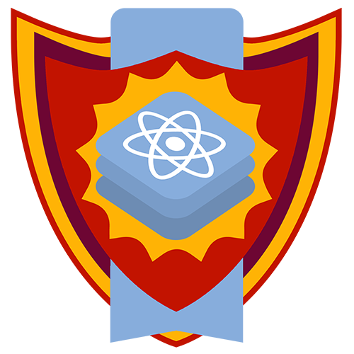

# Caderno 24 - Introdução ao ReactJS

>   Aprenda os conceitos sobre ReactJS, ferramenta usada para a criação de interfaces para os usuários.

## Aula 01 - Introdução ao ReactJS

Requisitos Básicos

-   JavaScript
-   CSS
-   HTML
-   IDLE
-   NPM

### História e conceitos

"Uma biblioteca JavaScript para criar interfaces de usuário" - Reactjs

-   Criado em 2011 por Jordan Walke no Facebook;

-   Baseado no XHP, um framework para criação de HTML no PHP;

-   Utilizado no mural de noticias da ferramenta Facebook

    -   2012 - utilizado no Instagram

    -   2013 - Anúncio para liberação OpenSource na JSConf US

    -   2015 - React Native

    -   2015 - UWP (Universal Windows Platform)

React é uma biblioteca e não um framework;

A principal função é a criação da interface para o usuário.

React é uma linguagem declarativa.

Declarativa vs Imperativa.

O React está preocupado apenas com o que é exibido na interface do usuário.

Pode ser usado em qualquer lugar

O React é baseado em componentes.

### Aprenda a configurar o ReactJS

-   React Create App

-   React Scripts

-   Task Runners e Bundler Sizers

Comandos:

-   `npm init` - para iniciar o projeto, em sequencia da enter em tudo.

-   `npm install --save react@16.8.6 react-dom@16.8.6 react-scripts@3.0.1`

### O que é JSX
